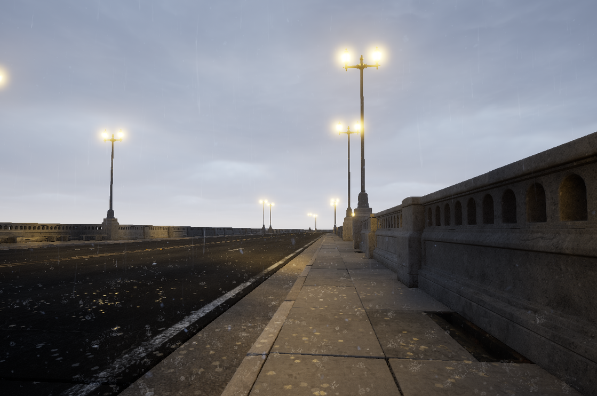

# 橋を作る

[automotive bridge scene](https://www.fab.com/ja/listings/a472df9d-9179-4743-8d41-335f9ef55546)

1. `/Content/AutomotiveBridgeScene/Blueprints/BP_CurvedBridge`, `BP_StraightBridge`を開きます。これをつなぎ合わせていくことで橋を作ります。
2. Lampが動きませんので、選択した上で`Static Mesh`を`city sample`に入っている`/Content/Prop/Kit_StreetLamp_C/Mesh/streetLampC`と入れ替えます。
3. 私はベンチのところを`traversable(トラバーサブル)`するためにGASの`/Content/LevelPrototyping/LevelBlock_Traversable`を入れています。Base Materialを`/Content/Characters/Echo/Materials/M_hide`にして透明にします。

