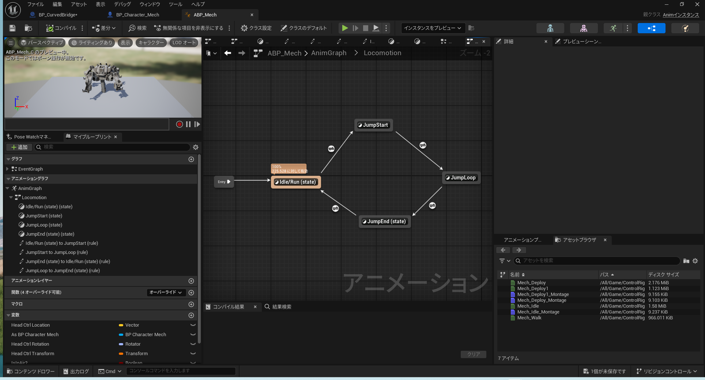
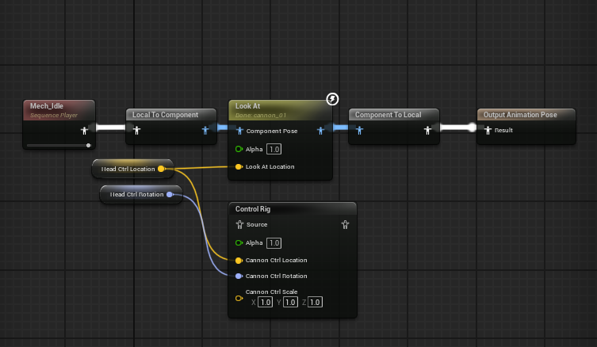

# ボスを作る

敵(enemy)やボス(boss)には必要なものが多いです。動きや攻撃パターン、エフェクト、ステータスやドロップアイテム、ゲージ表示、BGMなどが必要になります。場合によっては演出も必要です。

<iframe width="100%" height="415" src="https://www.youtube.com/embed/BsLOlAr-wBY?si=jahPUVD8YMMfefvm&amp;start=20&end=50&amp;mute=1&rel=0&showinfo=0&controls=0" title="YouTube video player" frameborder="0" allow="accelerometer; autoplay; clipboard-write; encrypted-media; gyroscope; picture-in-picture; web-share" referrerpolicy="strict-origin-when-cross-origin" allowfullscreen></iframe>

bossは`/Content/ControlRig/Characters/Mech`を元に作ります。

## 注意

ここからはbattle systemのassetを購入したほうがいいかもしれません。できれば評価が高くsale中のものを選びましょう。ほとんどこれ一つでゲームが作れてしまうので、多くの開発者はこのジャンルのassetを改造してゲームを作っています。スタイリッシュアクションの動きを見るとわかります。

https://www.fab.com/category/game-template/rpg

## 動きを作る

まずABPを作成し、基本的なAnimGraphを作成します。

projectにはsampleのABPがあるはずですからAnimGraphに`idle`, `jump`, `run`などが揃っているをcopyします。

ここでは`AnimGraph -> Locomotion -> Idle`を編集します。

動きはABPの`Look At`が使えます。boneを指定するとPlayerに追従します。

`[Mech_Idle] --> [Look At](Bone to Modify:cannon_01) --> Output Animation Pose`

## 攻撃を作る

私は最初に購入したassetの[space frontier stations & ships](https://docs.google.com/document/d/1p5MY13cpTlVtqP7sCQpAoE_k5VHklmndZ4cHeBy105Y/edit?tab=t.0#heading=h.nx19nrsdk37u)を使いました。なお、購入はおすすめしません。長いので以降は`space station`とします。

ここからはassetの解説になります。しかし、基本的な考え方については変わりません。まずは考え方を紹介します。

1. ターゲットをロック
2. ダメージ処理

ターゲット(target)をロック(lock)できるようなシステムは大抵、攻撃頻度やダメージ、コリジョンなど基本設定ができるようになっています。`epic games`が提供するassetや無料のassetでも同じです。そういった物を見つけてbossのBPに組み込みます。

ただし、ダメージ処理、例えば、HP管理や倒された時の処理は自分で書く必要があるかもしれません。

### 最初に触ったassetが影響を与える

ここからは少し昔の話をします。基本的には読み飛ばしてください。

私はueで最初に触り始めたのがこのasset(space station)でした。当時は何もわからずに手探りで自分のモデルを表示して遊んでいました。宇宙空間に自分のモデルを表示したときは本当に嬉しくて感動しました。

当時は`superhero flight animations`という空を飛ぶためassetも購入して同時に使っていましたが、今でもその影響は残っています。

その人のゲーム作りは最初に触ったassetが強く影響を与えるのだと思います。これはgame engineも同じです。

### space stationの基本構造

1. `/Content/SpaceStation/Blueprints/Weapons`で各武器のタイプを選べます。ここでは`BP_TurretGatling`を開きます。
2. `/Content/SpaceStation/Blueprints/Weapons/BP_TurretGatling(Self)`の詳細から`Weapon -> Shooting Delay:1`にして`Turret -> Turret Aiming Speed:150`にします。これは発射速度とターゲットに合わせる速度の設定です。
3. `/Content/SpaceStation/Blueprints/Weapons/Parent/DT_WeaponTypes`を開きます。ここで弾丸の音(sound)やエフェクト(effect)を設定します。
4. 最後に`/Content/Blueprints/CBP_SandboxCharacter(Self)`の詳細で`actor(アクタ) -> Tags[0] -> Allow Shooting`, `Tags[1] -> ShootingTarget`を追加します。これでPlayerがターゲットにロックされるようになります。
5. あとは`/Content/SpaceStation/Blueprints/Weapons/BP_TurretGatling`をmapに置いてください。

### ダメージ処理

damage(ダメージ)の処理を書きます。

`/Content/Blueprints/CBP_SandboxCharacter`で`Event Any Damage`を追加します。これでdamageを受けますが、hpを用意してそれが0になったときゲームオーバー(gameover)する処理を書いたりします。

<iframe src="https://blueprintue.com/render/xbwy4u36/1" scrolling="no" allowfullscreen style="width:100%;height:400px"></iframe>

これはGame Ability System(GAS)を使うと便利です。

https://dev.epicgames.com/documentation/ja-jp/unreal-engine/gameplay-ability-system-for-unreal-engine

## HPゲージの表示

`widget`で`ProgressBar`を作ります。まず`BP_Mech`にbox collisionを入れて、そこに入ると`boss active`になります。`true`ならwidgetを表示する仕組みです。

ProgressBarは`0.0 -> 1.0`なので注意してください。`HP_Current`から`HP_Max`を割り算します。

<iframe src="https://blueprintue.com/render/xbwy4u36/2" scrolling="no" allowfullscreen style="width:100%;height:400px"></iframe>

## 撃破処理

bossを撃破するまでの処理を書きます。

damageを受けて0になると消滅し、ドロップアイテムを落とします。消滅時はniagaraでeffectを再生します。damageを受けたときも同じです。

ドロップアイテムは`nice interaction system`というassetを使用しています。これは`E`を押すとアイテム(item)が取得できるものです。

<iframe src="https://blueprintue.com/render/xbwy4u36/3" scrolling="no" allowfullscreen style="width:100%;height:400px"></iframe>

