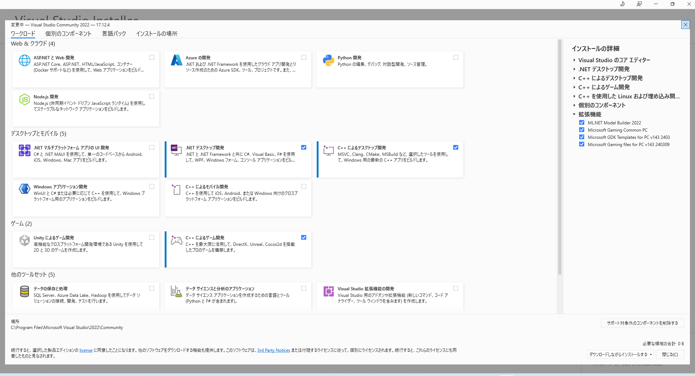

# install

srcからbuildしない場合は`epicgames launcher`からinstallします。

https://www.unrealengine.com/download

また、[vsinstaller](https://visualstudio.microsoft.com/ja/downloads/)を使用して必要なpackageを入れてください。



[vscode](https://github.com/microsoft/vscode)でbuildするには`.uproject`を右クリックして`.sln`を作ります。

## package build

まずは新しいprojectを作り、package buildできるかを試してみましょう。

ueではbuildが通らないことがよくあります。長い時間をかけて作り上げたもののbuildが通らない事態は避けましょう。

なお、`mac`, `linux`は、ほとんどうまくいきません。package化に成功してもappが正常に起動しないことがあります。使用するpluginやassetなども影響します。

```sh
# corss compile tool : https://dev.epicgames.com/documentation/ja-jp/unreal-engine/linux-development-requirements-for-unreal-engine
# ubuntu(xorg + nvidia)

$ sudo apt-get install xorg xvfb
Xvfb :99 &
export DISPLAY=:99

$ sudo apt-get install vulkan-tools
$ sudo apt-get install mesa-vulkan-drivers
```

## engineとproject

installする場所は自分で決められます。参考の場所を紹介します。

```sh
# engine
C:\Program Files\Epic\UE_5.5\Engine\Binaries\Win64\UnrealEditor.exe

# project
C:\Users\$USER\Documents\Unreal Projects\MyProject\MyProject.uproject
```

