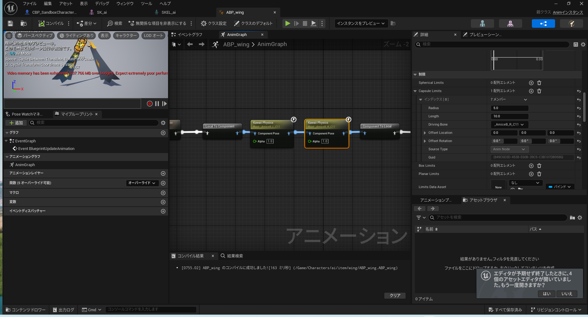

# 揺れものを設定する

[kawaiiphysics](https://github.com/pafuhana1213/kawaiiphysics)

`$project/Plugins/kawaiiPhysics/kawaiiPhysics.uplugin`

1. 基本的には`/Content/Characters/$model/ABP_Pose_$model`に設定します。
2. 外付けの服などに設定する場合はABPを作成し、そこに設定します。

服が揺れる様子です。`limit(制限) -> Capsule Limits -> Driving Bone`にBone(ボーン)を入れて体に入りこまないようにしています。

<iframe width="100%" height="415" src="https://www.youtube.com/embed/0Ig_-JSRV0M?si=Kz_jCbYTHr_OzPpP&start=28&end=50&mute=1&rel=0&showinfo=0&controls=0" title="YouTube video player" frameborder="0" allow="accelerometer; autoplay; clipboard-write; encrypted-media; gyroscope; picture-in-picture; web-share" referrerpolicy="strict-origin-when-cross-origin" allowfullscreen></iframe>
